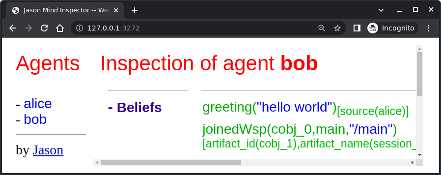
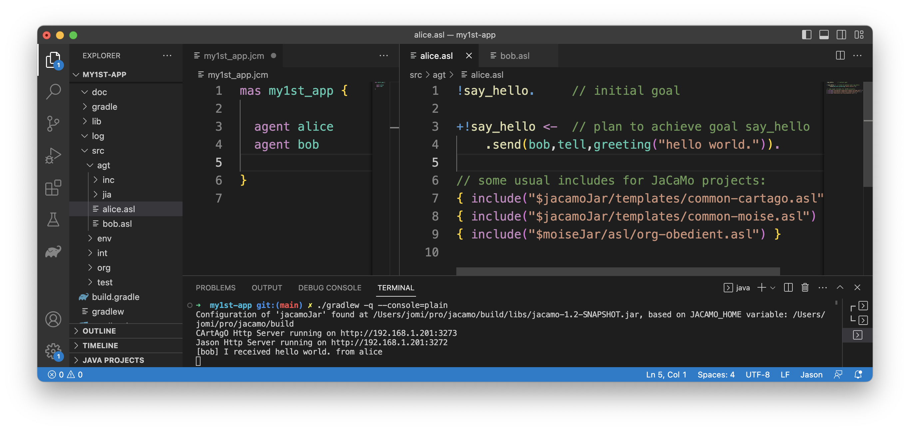
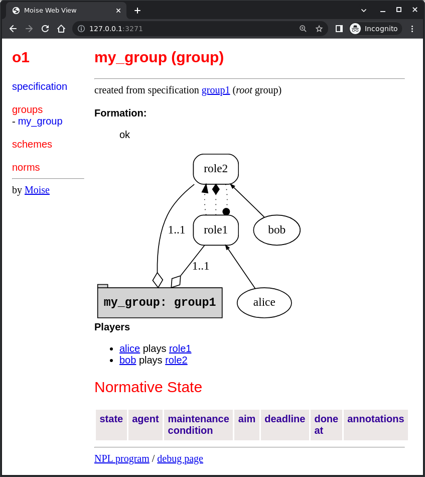
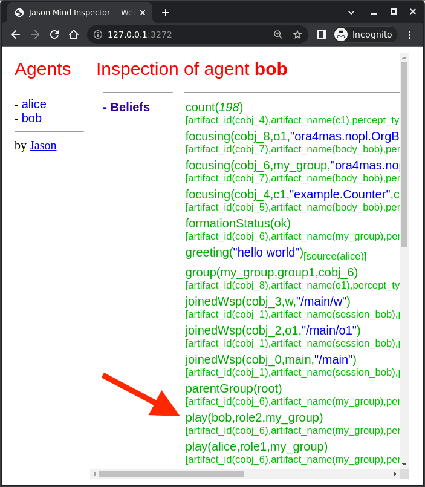

## Getting Started as a JaCaMo Application Developer

This guide walks you through the process of creating a Multi-Agent
application using JaCaMo platform.

## What You Will Build

You will build a very simple Multi-Agent System composed of two agents
that exchange simple messages. These agents are named Bob and Alice. In
the application, Alice sends a hello message to Bob, they are situated
in the same environment and participate into an organisation.

## What You Need

-   Java 17 or newer

-   A shell terminal

-   A text editor (Visual Studio Code, Notepad, …)

## Creating an initial application

The following commands will create a new [JaCaMo
application](#../terminology.adoc#jacamo_application) identified by
`my1st-app` with some initial source code for
[agents](#../terminology.adoc#agent),
[environment](#../terminology.adoc#environment) and
[organization](#../terminology.adoc#organization). (The first time you
run JaCaMo takes longer since it downloads all dependencies.)

> **NOTE**: You find alternatives to create JaCaMo applications
[here](http://jacamo-lang.github.io/jacamo/install.html) (using
codespace/gitpod/docker/…).

Unix:

    wget -q http://jacamo-lang.github.io/jacamo/nps/np1.2.zip
    unzip np1.2.zip
    ./gradlew -Dexec.args="my1st-app --console"

If you do not have `wget` installed, an alternative is:

    curl -LO http://jacamo-lang.github.io/jacamo/nps/np1.2.zip
    unzip np1.2.zip
    ./gradlew -Dexec.args="my1st-app --console"

Windows: 
1.  Download <http://jacamo-lang.github.io/jacamo/nps/np1.2.zip>

2.  Unzip

3.  Run `gradlew.bat`. When asked to give an identification, you should
    answer `my1st-app`.

Example of output:

    Creating JaCaMo application my1st-app

    You can run your application with:
       cd .../my1st-app
       ./gradlew -q --console=plain

Several files and folders were created, the most relevant are:

    ├── my1st_app.jcm      // JaCaMo application file
    ├── build.gradle       // Gradle script to run the application
    ├── logging.properties // Logging configuration
    └── src
        ├── agt            // Code for agents
        │   └── sample_agent.asl
        ├── env            // Code for environment
        │   └── example
        │       └── Counter.java
        ├── org            // Code for organisation
        │   └── org.xml
        └── test           // Code for testing

## Execution

The application is ready to be executed with the commands:

    cd my1st-app
    ./gradlew -q --console=plain

producing the following output:

    CArtAgO Http Server running on http://127.0.0.1:3273
    Jason Http Server running on http://127.0.0.1:3272
    [Cartago] Workspace w created.
    [Cartago] artifact c1: example.Counter(3) at w created.
    [sample_agent] join workspace /main/w: done
    [sample_agent] focusing on artifact c1 (at workspace /main/w) using namespace default
    [sample_agent] focus on c1: done
    [sample_agent] hello world.

As you can see in the last line, an agent named `sample_agent` has
printed a "Hello World" message. The JaCaMo Application however keeps
running, even without having anything to do. To stop the execution, you
can press &lt;CTRL&gt;-C.

## Creating agents alice and bob

So, you will now remove this `sample_agent` from the application and add
alice and bob.

The file `my1st_app.jcm` contains the list of initial agents of the MAS.
Edit this file so that is looks as follows:

**my1st\_app.jcm**

    mas my1st_app {

        agent alice
        agent bob

    }

The source codes of these agents are expected to be in the files
`alice.asl` and `bob.asl` placed in the folder `src/agt`. Using your
preferred editor, create the file `src/agt/alice.asl` as follows:

**alice.asl**

    !say_hello.   // initial goal

    +!say_hello   // plan to achieve goal say_hello
       <- .send(bob,tell,greeting("hello world")).

    // some usual includes for JaCaMo projects:
    { include("$jacamo/templates/common-cartago.asl") }
    { include("$jacamo/templates/common-moise.asl") }
    { include("$moise/asl/org-obedient.asl") }

This code states that alice has one [goal](#../terminology.adoc#goal),
created when alice starts running. This goal can be achieved by a
[plan](#../terminology.adoc#plan) (3rd and 4th lines) that simply sends
a [message](#../terminology.adoc#message) to another agent named bob
telling him `greeting("hello world")`.

details about the language used to code the agents and the language used
for their communication is covered in other documents.

The source code for bob (file `src/agt/bob.asl`) is:

**bob.asl**

    +greeting(M)[source(A)] <-  // plan to react to new beliefs
        .print("I received ",M," from ",A).

    // some usual includes for JaCaMo projects:
    { include("$jacamo/templates/common-cartago.asl") }
    { include("$jacamo/templates/common-moise.asl") }
    { include("$moise/asl/org-obedient.asl") }

This plan states that as soon as bob has a
[belief](#../terminology.adoc#belief) that matches
`greeting(M)[source(A)]`, it prints out a message. This belief is added
in his mind as the consequence of receiving alice’s message.

Execute the application again with the command
`./gradlew -q --console=plain` and now the output is:

    [bob] I received hello world from alice

You can now open the Mind Inspector by clicking at
<http://127.0.0.1:3272> and select `bob` in the list of agents. As you
can see, bob’s belief is `greeting("hello world")[source(alice)]`. When
his plan is executed, variable `M` is bound to `"hello world"` and `A`
to `alice`.

It follows also a screenshot of the project execution when using Visual
Studio Code as the IDE.

## Using a shared environment

The environment provides perception for the agents and is where their
actions take place. In our application, agents will share an artifact of
the environment to get unique identifiers. This kind of artifact is
already included in the initial project. It is in the file
`src/env/example/Counter.java`, so you do not need to implement it. We
will focus thus on how agents use it.

First, you need to set up our MAS environment with an instance of the
Counter artifact. Second, our agents should focus on this artifact.
These set up can be done changing the application file:

**my1st\_app.jcm**

    mas my1st_app {

      agent alice {
        focus: w.c1
      }
      agent bob {
        focus: w.c1
      }

      workspace w {
        // create a counter artifact named c1 with  initial value = 3
        artifact c1: example.Counter(3)
      }
    }

Note that both agents are focusing on the same artifact (identified by
`c1` in workspace `w`). This artifact provides a `count` perception to
the agents, which is stored in their belief base. You can notice that by
running the application and taking a look at the mind inspector:

Now you can also inspect the environment state at
<http://127.0.0.1:3273>:

The artifact also provides two actions: `inc` and `inc_get`. The latter
increments the counter and returns the new value. Let’s change Alice’s
source code to perform this action to continually increment the counter:

**alice.asl**

    // initial goals
    !say_hello.
    !count.                              // *** new goal

    // plan to achieve goal say_hello
    +!say_hello
       <- .send(bob,tell,greeting("hello world")).

    // plan to achieve goal count        // ** new plan
    +!count
       <- inc_get(1,NewValue);           // ** acting on the environment
          .print("I've got the unique value of ",NewValue);
          .wait(1000);
          !count. // continue counting

    // some usual includes for JaCaMo projects:
    { include("$jacamo/templates/common-cartago.asl") }
    { include("$jacamo/templates/common-moise.asl") }
    { include("$moise/asl/org-obedient.asl") }

Now, we will code Bob to also increment the counter continuously. Bob
uses the operation `inc` instead of `inc_get`, that has no parameter: it
increments the counter by 1. Since changes in the counter produces
changes in the belief `count`, Bob reacts to this changes printing the
new perceived value:

**bob.asl**

    // *** initial goal
    !count.

    // plan to react to new beliefs
    +greeting(M)[source(A)]
       <- .print("I received ",M," from ",A).

    // *** plan to achieve goal count
    +!count
       <- inc;          // act on the  environment
          .wait(2000);  // wait a bit and
          !count.       // keep counting

    // *** plan to react to changes in belief count
    +count(X)
       <- .print("counter = ",X).

    // some usual includes for JaCaMo projects:
    { include("$jacamo/templates/common-cartago.asl") }
    { include("$jacamo/templates/common-moise.asl") }
    { include("$moise/asl/org-obedient.asl") }

So both agents are incrementing the value of a shared counter. Alice is
getting unique values (for purposes not considered here) and Bob is just
printing the values as soon as they are perceived:

    [bob] counter = 3
    [alice] I've got the unique value of 4
    [bob] counter = 4
    [bob] I received hello world from alice
    [bob] counter = 5
    [alice] I've got the unique value of 5
    [bob] counter = 6
    [alice] I've got the unique value of 6
    [bob] counter = 7
    [alice] I've got the unique value of 7
    [bob] counter = 8
    [alice] I've got the unique value of 8
    [bob] counter = 9
    [alice] I've got the unique value of 9
    [alice] I've got the unique value of 10
    [bob] counter = 10
    [alice] I've got the unique value of 11
    [bob] counter = 11
    [alice] I've got the unique value of 12
    [bob] counter = 12
    [alice] I've got the unique value of 13
    [bob] counter = 13
    [bob] counter = 14
    [alice] I've got the unique value of 14
    [alice] I've got the unique value of 15
    [bob] counter = 15
    [bob] counter = 16
    [alice] I've got the unique value of 16

## Participating to an organisation

Let’s make the agents participate to an
[organisation](#../terminology#organisation). For that purpose, agents
will play [roles](#../terminology.adoc#role) in
[groups](#../terminology.adoc#group) of the organisation. We will create
a [group instance](#../terminology.adoc#group_instance) of `group1` that
Alice and Bob will join by adopting roles `role1` and `role2`,
respectively.

All possible groups and roles of an organisation should be specified in
an XML file. Here we will use the specification that is already included
in the initial project (file `src/org/org.xml`). This specification
defines a group type identified by `group1` and the two mentioned roles
for this group. To create an instance of this group and assign its roles
to our agents, you can change the application project to:

**my1st\_app.jcm**

    mas my1st_app {

      agent alice {
        focus: w.c1
        roles: role1 in my_group
      }
      agent bob {
        focus: w.c1
        roles: role2 in my_group
      }

      workspace w {
        artifact c1: example.Counter(3)
      }

      organisation o1 : org.xml {
        // create a group instance identified by my_group
        group my_group: group1
      }
    }

Now you can run the application and inspect the organisation state at
<http://127.0.0.1:3271>:

The organisation provides several information for the agents to
consider:

For the agent programming, we will change Alice’s source code so that
instead of sending a message to an agent named Bob, Alice sends a
message to an agent playing `role2`:

**alice.asl**

    // new plan to achieve say_hello
    +!say_hello
       <- .wait(play(Ag,role2,_)); // waits for a belief play/3 with the second term equals role2.
                                   // Ag is bound to the name of the agent playing role2
          .send(Ag,tell,greeting("hello world")).

Using this implementation, Alice’s code is not tightly coupled with Bob
anymore. Another agent can replace Bob as the player of `role2` and
Alice keeps running correctly.

## What you have learnt

In this brief tutorial, you have learnt:

-   how to create a JaCaMo Project,

-   how the source code of the project is usually structured, and

-   how to execute and see the current state of a JaCaMo application.
