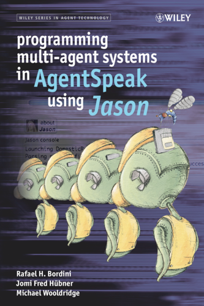

This page contains publications related to JaCaMo. To include your publication in the list, [add an issue](https://github.com/jacamo-lang/jacamo-lang.github.io/issues/new?assignees=&labels=publication&projects=&template=new-publication.md&title=new+publication) or [edit this page](https://github.com/jacamo-lang/jacamo-lang.github.io/edit/main/_pages/publications.md)  (followed by a pull request).

## Books

| [JaCaMo book](https://mitpress.mit.edu/books/multi-agent-oriented-programming){:target="_blank"} | [Jason Book](https://www.wiley.com/en-gb/Programming+Multi+Agent+Systems+in+AgentSpeak+using+Jason-p-9780470029008){:target="_blank"} |
| {:width="200"} | {:width="180"} |
| [Examples & Exercises used in the book](https://jacamo-lang.github.io/documentation/maop-book/readme.html){:target="_blank"} | |

## Papers

  - Olivier Boissier, Rafael H. Bordini, Jomi F. Hübner, and Alessandro Ricci. Dimensions in programming multi-agent systems. The Knowledge Engineering Review, 34, 2019. [doi](http://dx.doi.org/10.1017/S026988891800005X)
